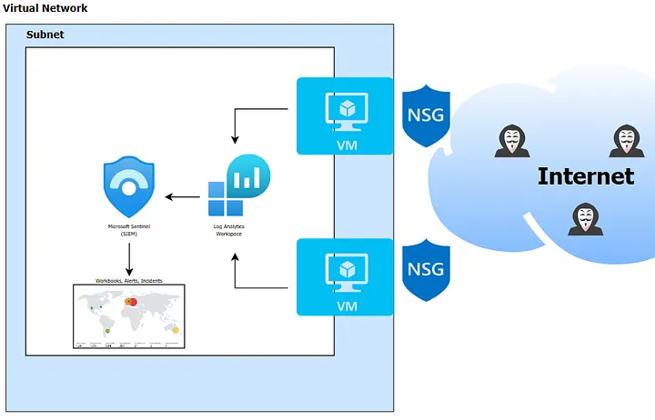
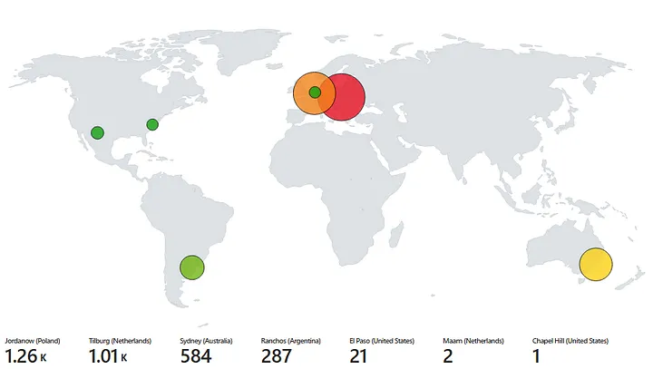
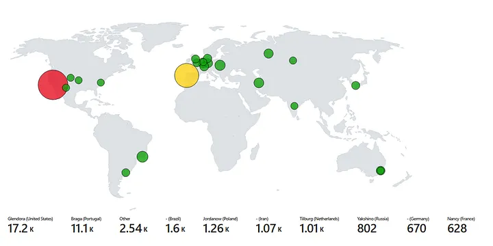

# LIVE SOC/SIEM Detection and Response Lab

  

This repository showcases the **LIVE SOC/SIEM Detection and Response Lab**, built in an **Azure cloud environment**. The lab simulates real-world threats by ingesting logs from Windows 11 VMs into **Microsoft Sentinel**, enabling detection, alerting, and incident response.  

To kick off my senior year, I deployed a **mini-honeynet** exposed to the internet for two separate 24-hour sessions, capturing live telemetry to study attacks, implement defenses, and measure results.

🔗 **Medium Blog:** [Live SOC SIEM Detection and Response Lab](https://medium.com/@gabriel.walkerzuniga/live-soc-siem-detection-and-response-lab-eaede7fa6dd2)  
🔗 **GitHub Repo:** [SOC-SIEM-Detection-and-Response](https://github.com/Gabe-ios/SOC-SIEM-Detection-and-Response)  

---

## ⚙️ Architecture Overview  

The lab environment consists of:

- **Virtual Network (VNet)**  
- **Network Security Group (NSG)**  
- **Two Windows 11 Virtual Machines**  
- **Log Analytics Workspace**  
- **Azure Storage Account**  
- **Microsoft Sentinel (SIEM)**  

---

## 🚨 Live Attack — Before Hardening  

  

- NSG allowed **all inbound traffic**; Windows Firewall disabled.  
- Lab left exposed for **24 hours** to capture unrestricted activity.  

### 📊 Metrics  
| Metric           | Count |
|------------------|-------|
| SecurityEvent    | 45k   |
| Security Alert   | 32    |
| SecurityIncident | 47    |

### 🔎 Observables  
- **Failed Login Attempt Map** (via Azure Workbooks)  
- **24-hour Attack Graph** (Sept 4, 2025 — Sept 5, 2025)  

---

## 🛡️ Live Attack — After Hardening (Attempt 1)  

  

- **Windows Firewall enabled**  
- **NSG reset to default** instead of “allow all inbound traffic”  

### 📊 Metrics  
| Metric           | Count |
|------------------|-------|
| SecurityEvent    | 45k   |
| Security Alert   | 10    |
| SecurityIncident | 16    |

### 📉 Percent Change (Before vs. After Hardening)  
| Metric           | Change   |
|------------------|----------|
| Security Alert   | -68.75%  |
| SecurityIncident | -65.96%  |

---

## ✅ Conclusion  

- **Threat volume decreased significantly**, but persistent attacks continued.  
- Hardened defenses reduced alerts/incidents, but **further tuning required**.  
- Next steps include:  
  - Developing **stronger NSG firewall rules**  
  - Building **incident response playbooks** from telemetry  
  - Expanding lab for continuous detection, hunting, and response  

---

<i>This is an ongoing project with regular updates as defenses evolve and new attacks are studied.</i>

